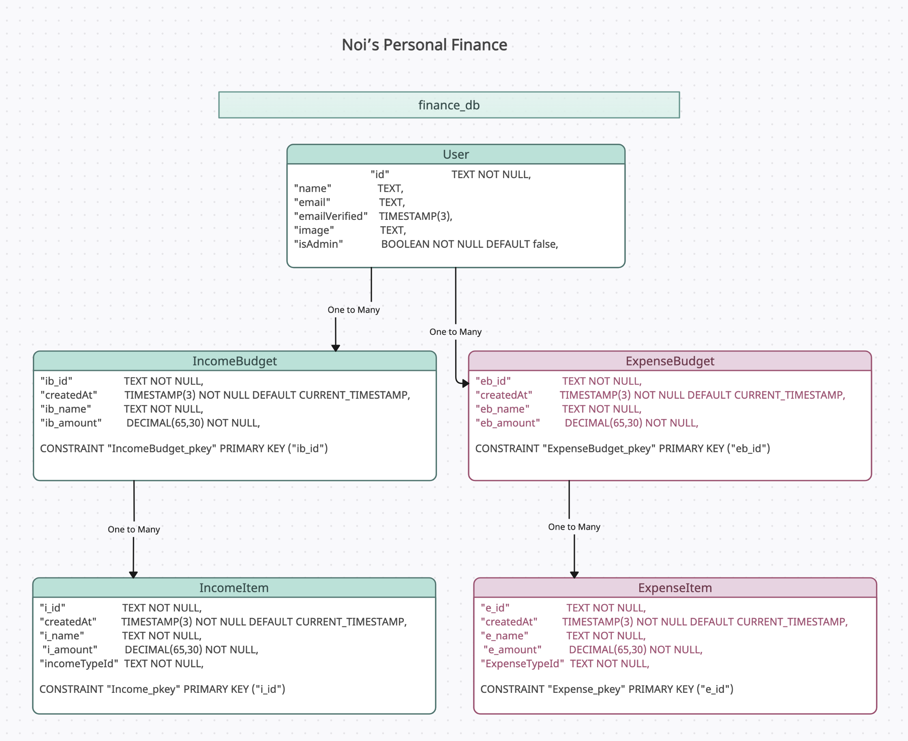
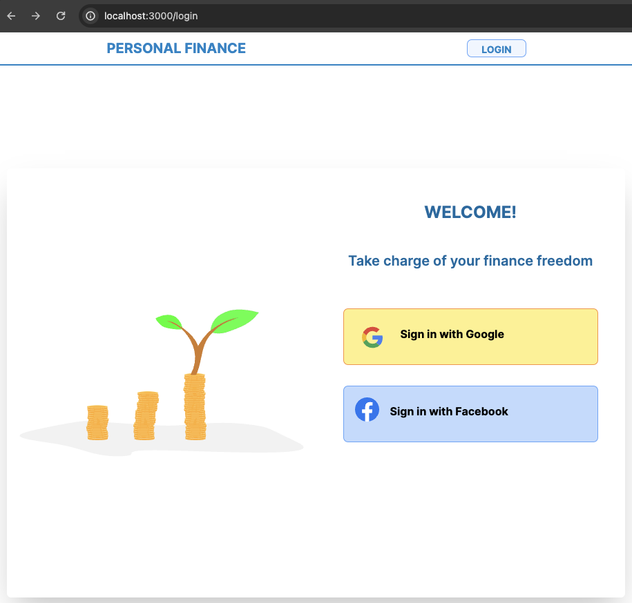
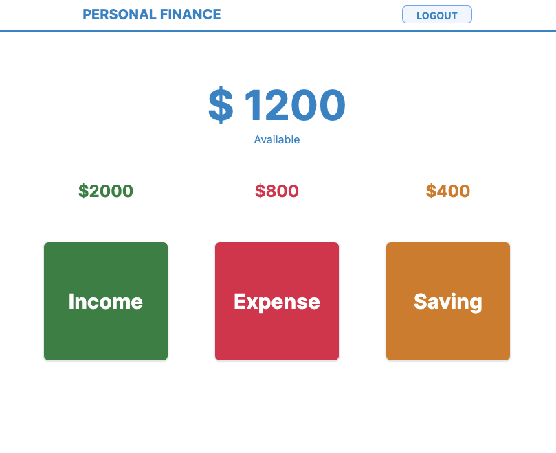
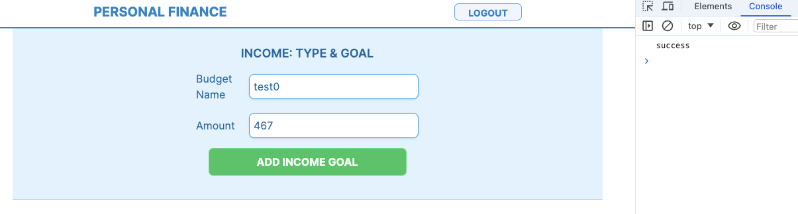
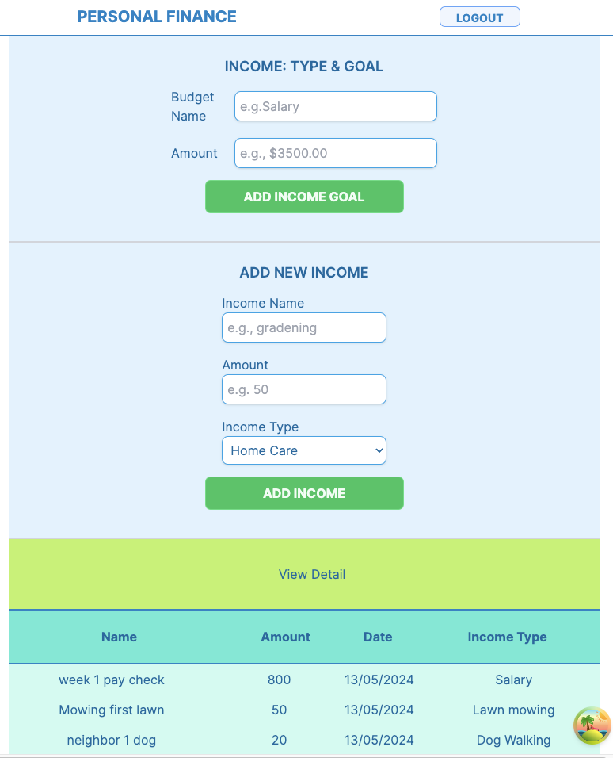

# Getting Started with Personal Finance App

Welcome to the Personal Finance Manangement repository! This README will guide you through setting up the project and understanding its structure.

## Clone the Repository

- Clone the main repository branch to your local computer using the following command:
  `git clone <repo code>`

## Setup Project for developement environment

1. run npm install
2. Create .env file at the root
3. Sign up to Google Fire base to create your own API key
   `https://console.firebase.google.com/`
4. Create a database name `finance_db` in your Postgres database
5. Add your credentials in the .env as shown below

```
DATABASE_URL="postgresql://<your-db-username>:<your-db-password>@localhost:<PORT>/finance_db?schema=public"
NEXTAUTH_URL=http://localhost:<PORT>
NEXTAUTH_SECRET="You should add random text here and this is my"
GOOGLE_ID=<your-google-credential>
GOOGLE_SECRET=<your-google-secrate>
```

## Build database

1. Run `npx prisma migrate dev`
2. It will ask for a name - you can provide any name
3. After the database finish building

- on the menu of your code editor
- go to prisma > migration > to see Postgresql code

4. Optional: to see data on prisma studio `npx prisma studio`

## Run project in development environment

`npm run dev`

## Tech Stacks

### Backend:

- Next.js

### Frontend:

- React
- React-Redux-TanStack
- Tailwind css

### Authentication

- Firebase

### Database

- Postgresql
- Prisma ORM



### Login Page



### Landing Page




